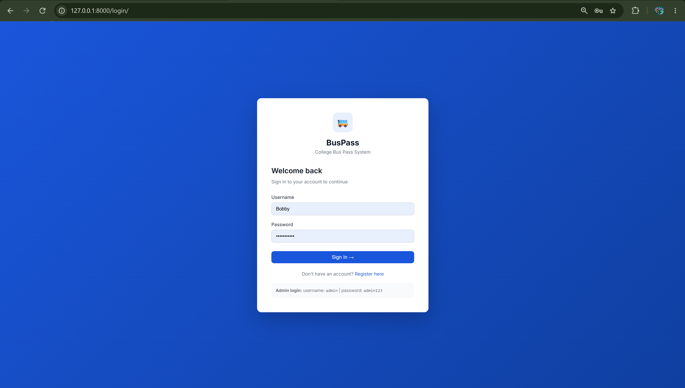
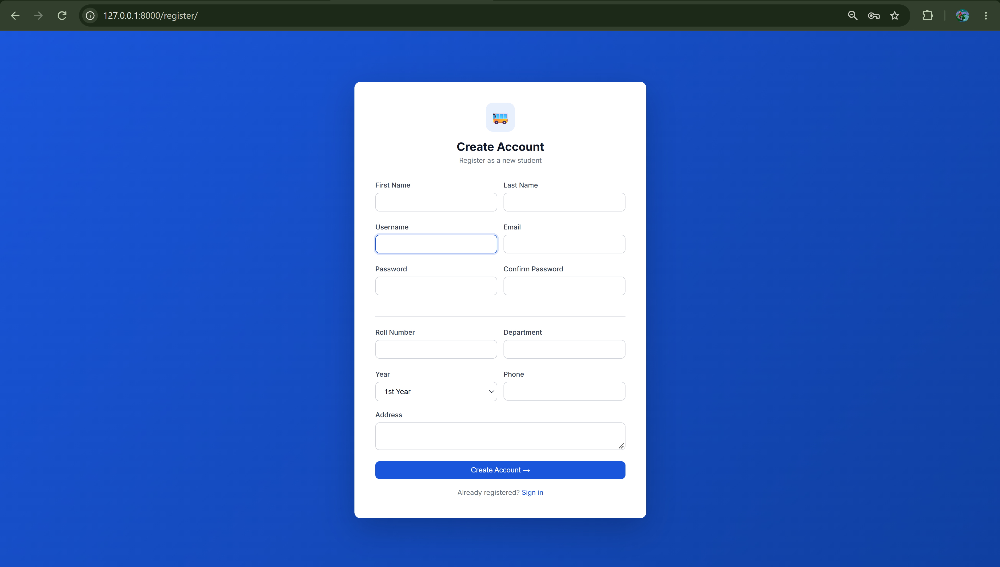
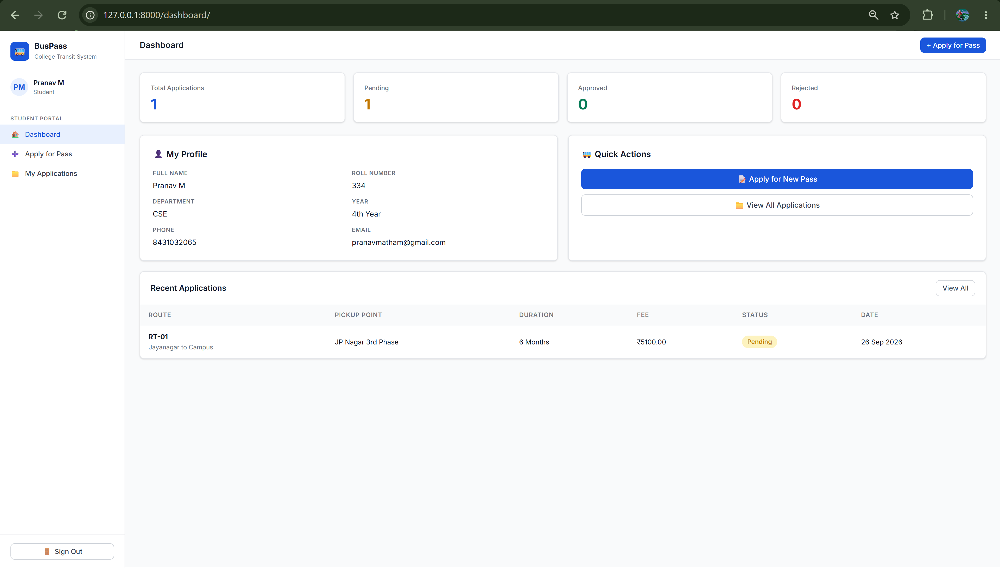
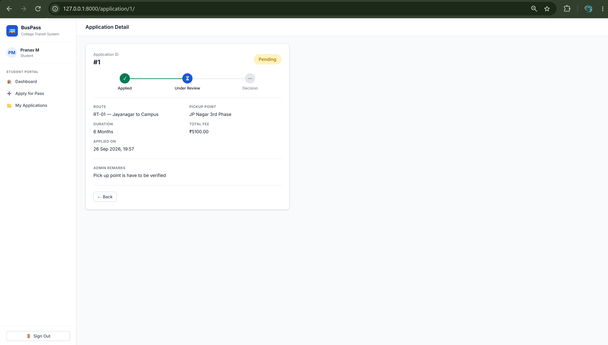
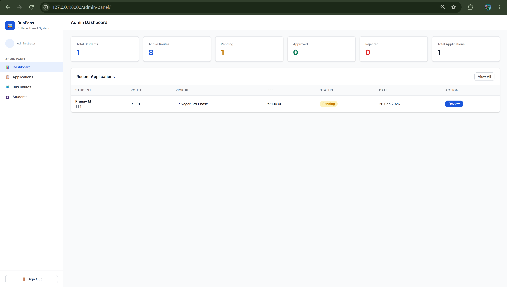
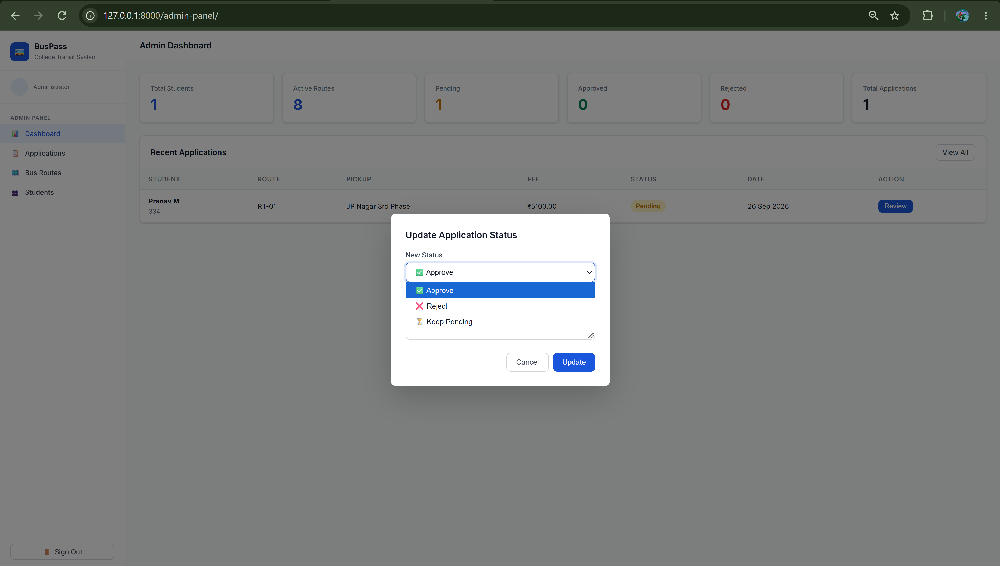
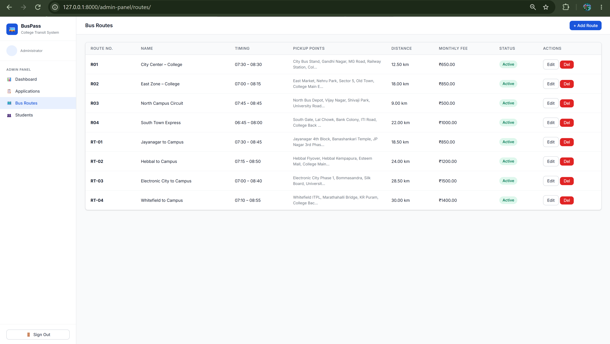

# 🚌 BusPass — College Bus Pass Management System

A full-stack Django web app that replaces manual bus pass processing in colleges with an online workflow.

---

## 📁 Project Structure

```
buspass_project/
├── buspass_project/          # Django project config
│   ├── settings.py
│   ├── urls.py
│   └── wsgi.py
├── core/                     # Main app
│   ├── models.py             # StudentProfile, BusRoute, BusPassApplication
│   ├── views.py              # All view logic (student + admin)
│   ├── forms.py              # Registration, Application, Route forms
│   ├── urls.py               # URL routing
│   ├── admin.py              # Django admin registration
│   └── management/
│       └── commands/
│           └── seed_data.py  # Admin + sample routes seeder
├── templates/core/
│   ├── base.html             # Sidebar layout base
│   ├── home.html             # Landing page
│   ├── login.html            # Login page
│   ├── register.html         # Student registration
│   ├── student_dashboard.html
│   ├── apply_pass.html       # Dynamic application form
│   ├── my_applications.html
│   ├── application_detail.html
│   ├── admin_dashboard.html
│   ├── admin_applications.html
│   ├── admin_routes.html
│   ├── admin_route_form.html
│   └── admin_students.html
├── static/css/
│   └── style.css             # Complete UI stylesheet
├── db.sqlite3                # SQLite database
└── manage.py
```

---

## 🗄️ Database Schema

### `auth_user` (Django built-in)
| Field | Type |
|-------|------|
| id | INT PK |
| username | VARCHAR |
| email | VARCHAR |
| first_name | VARCHAR |
| last_name | VARCHAR |
| password | VARCHAR (hashed) |
| is_staff | BOOLEAN |

### `core_studentprofile`
| Field | Type |
|-------|------|
| id | INT PK |
| user_id | FK → auth_user |
| roll_number | VARCHAR UNIQUE |
| department | VARCHAR |
| year | INT (1–4) |
| phone | VARCHAR |
| address | TEXT |
| created_at | DATETIME |

### `core_busroute`
| Field | Type |
|-------|------|
| id | INT PK |
| route_number | VARCHAR UNIQUE |
| route_name | VARCHAR |
| pickup_points | TEXT (comma-separated) |
| start_time | TIME |
| end_time | TIME |
| distance_km | DECIMAL |
| monthly_fee | DECIMAL |
| is_active | BOOLEAN |

### `core_buspassapplication`
| Field | Type |
|-------|------|
| id | INT PK |
| student_id | FK → core_studentprofile |
| route_id | FK → core_busroute |
| pickup_point | VARCHAR |
| duration_months | INT |
| total_fee | DECIMAL |
| status | VARCHAR (pending/approved/rejected) |
| admin_remarks | TEXT |
| applied_at | DATETIME |
| valid_from | DATE |
| valid_until | DATE |

---

## ⚙️ Setup Instructions

### 1. Prerequisites
```bash
Python 3.10+
pip
```

### 2. Clone / Extract Project
```bash
cd buspass_project
```

### 3. Create Virtual Environment
```bash
python -m venv venv
source venv/bin/activate        # Linux/Mac
venv\Scripts\activate           # Windows
```

### 4. Install Dependencies
```bash
pip install django
```

### 5. Apply Migrations
```bash
python manage.py makemigrations
python manage.py migrate
```

### 6. Seed Initial Data (Admin + Sample Routes)
```bash
python manage.py seed_data
```

### 7. Run the Server
```bash
python manage.py runserver
```

Open: **http://127.0.0.1:8000/**

---

## 🔐 Default Credentials

| Role | Username | Password |
|------|----------|----------|
| Admin | `admin` | `admin123` |
| Student | Register at `/register/` | — |

---

## 🔄 System Flow

```
Student visits /register/ → Creates account
    ↓
Logs in at /login/ → Redirected to /dashboard/
    ↓
Clicks "Apply for Pass" → Selects route, pickup, duration
    ↓
Submits application → Status: PENDING
    ↓
Admin logs in → Views /admin-panel/applications/
    ↓
Admin clicks "Update" → Sets Approved / Rejected + remarks
    ↓
Student sees status update on dashboard & application detail page
```

---

## 🌐 URL Reference

| URL | Description |
|-----|-------------|
| `/` | Landing page |
| `/register/` | Student registration |
| `/login/` | Login |
| `/dashboard/` | Student dashboard |
| `/apply/` | Apply for bus pass |
| `/my-applications/` | View all applications |
| `/application/<id>/` | Application detail + status timeline |
| `/admin-panel/` | Admin dashboard |
| `/admin-panel/applications/` | Manage all applications |
| `/admin-panel/routes/` | Manage bus routes |
| `/admin-panel/students/` | View all students |
| `/api/route/<id>/` | JSON: route details (AJAX) |

---

## ✅ Features Implemented

- Student registration & login
- Admin login (staff flag)
- Apply for bus pass with dynamic route/pickup selector
- Real-time fee calculator
- Application status tracking with visual timeline
- Admin approve/reject with remarks
- Full CRUD for bus routes
- Filter applications by status
- Responsive sidebar layout
- SQLite database (no extra setup needed)


## 📸 Project Screenshots

### 1. Authentication & Onboarding
| Login Page | Registration Page |
| :---: | :---: |
|  |  |

### 2. Student Portal & Applications
| Student Dashboard | Bus Pass Application |
| :---: | :---: |
|  |  |

### 3. Admin Panel & Management
| Admin Dashboard | Application Approvals | Route Management |
| :---: | :---: | :---: |
|  |  |  |
